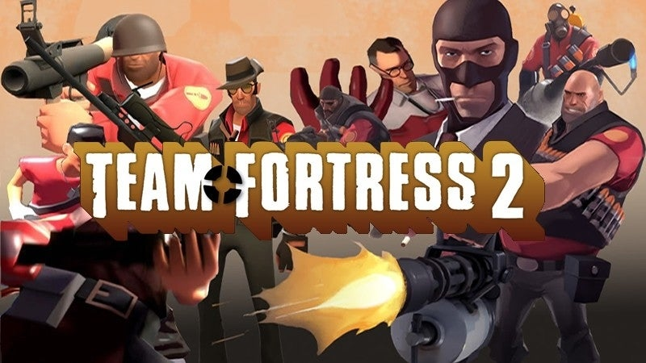

# Game Automata

Game Automata is a project designed to create an automatic game-playing client. It is primarily designed for the game **Team Fortress 2**, but it can be adapted for other games as well. The project's main goal is to evaluate the performance of a CPU by automating gameplay and observing how the system handles the load.

## Features

- **Game Automation**: Automates gameplay in Team Fortress 2 by performing actions such as movement, jumping, and shooting.
- **Performance Testing**: Evaluates CPU performance during gameplay by analyzing how the system handles the automated tasks.
- **Customizable**: Although designed for Team Fortress 2, the project can be adapted for other games with similar requirements.

## Requirements

- .NET Framework or .NET Core (depending on the implementation)
- Windows operating system
- Team Fortress 2 game installed and running

## Usage

1. **Download and Setup**: Download the source code for Game Automata and set it up in your development environment.
2. **Start Team Fortress 2**: Ensure that Team Fortress 2 is running before launching Game Automata.
3. **Run Game Automata**: Compile and run the main file (`Program.cs`). The program will search for the `hl2` process (Team Fortress 2) and bring it to focus.
4. **Automated Gameplay**: The program will automate gameplay by simulating keyboard and mouse inputs. It will perform actions such as moving forward, jumping, and shooting.
5. **Monitor CPU Performance**: Observe how your CPU performs during automated gameplay.

## Code Structure

- **Program.cs**: The main file contains the core functionality of the project. It initializes the process and simulates gameplay using keyboard and mouse inputs.
- **WindowsInput**: The project uses the Windows Input Simulator library to simulate keyboard and mouse actions.

## Notes

- The current implementation focuses on controlling Team Fortress 2. It can be adapted for other games by modifying the process name and game-specific actions.
- Ensure that you have the necessary permissions to control other applications, as the project interacts with a running game.

## Contributing

Contributions are welcome! Please fork the repository and submit pull requests with any improvements or additional features.

## License

This project is licensed under the [MIT License](LICENSE).

## Disclaimer

- The use of automated gameplay in online games can lead to penalties, bans, or other consequences. Use Game Automata responsibly and in accordance with the game's terms of service.
- The project is provided for educational purposes only and is not intended for any malicious use.
